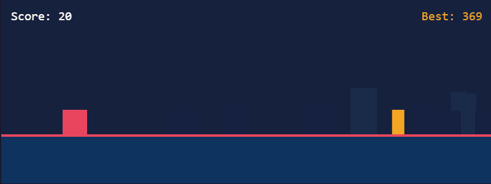

# Jungle Runner

[](https://pixijs.com/)
[](https://www.typescriptlang.org/)
[](https://react.dev/)
[](https://vitejs.dev/)
[]()

Endless runner built with PixiJS 8, React and TypeScript.

[▶ Play online](https://SEU-LINK-AQUI.vercel.app)



---

## English

### How to play

- **Space** or **tap the screen** to jump
- Dodge obstacles and survive as long as possible
- Speed increases over time

### Architecture

React is used only to mount and unmount the canvas — all game state lives outside React.

| Class             | Responsibility             |
| ----------------- | -------------------------- |
| `Game`            | Loop, state machine, input |
| `Player`          | Jump physics, hit flash    |
| `ObstacleManager` | Spawn, movement, culling   |
| `ScreenShake`     | Camera effect on stage     |
| `DustEmitter`     | Particle system on landing |
| `Background`      | Two-layer parallax         |

### Technical decisions

- **Delta time** on every update ensures consistent movement regardless of framerate
- **AABB with inner margin** on bounds avoids unfair collisions at sprite edges
- **Progressive difficulty** via `speed = 300 + score * 1.5`
- **High score** persisted in `localStorage`

### Run locally

```bash
npm install
npm run dev
```

---

## Português

### Como jogar

- **Espaço** ou **toque na tela** para pular
- Desvie dos obstáculos e sobreviva o máximo possível
- A velocidade aumenta com o tempo

### Arquitetura

React é usado apenas para montar e desmontar o canvas — todo o estado do jogo vive fora do React.

| Classe            | Responsabilidade                         |
| ----------------- | ---------------------------------------- |
| `Game`            | Loop, máquina de estados, input          |
| `Player`          | Física de pulo, flash de hit             |
| `ObstacleManager` | Spawn, movimento e remoção de obstáculos |
| `ScreenShake`     | Efeito de câmera aplicado ao stage       |
| `DustEmitter`     | Sistema de partículas ao pousar          |
| `Background`      | Paralaxe de duas camadas                 |

### Decisões técnicas

- **Delta time** em todos os updates garante movimento consistente independente do framerate
- **AABB com margem interna** nos bounds evita colisões injustas nas bordas dos sprites
- **Dificuldade progressiva** via `speed = 300 + score * 1.5`
- **High score** persistido em `localStorage`

### Rodar localmente

```bash
npm install
npm run dev
```

---

## License / Licença

MIT
